# Cats vs Dogs : CNN Image Classification

## 1. Project Overview

This project implements a **binary image-classification CNN** to distinguish between **cats and dogs**.

The model was built and trained in **Google Colab** using **TensorFlow/Keras**, with a **T4 GPU** available in the runtime.

The project focuses on:

- Building a CNN from scratch
- Loading an image dataset from Kaggle
- Resizing images to `256 × 256`
- Normalizing pixel values to `[0, 1]`
- Training with binary cross-entropy
- Monitoring training and validation accuracy/loss
- Investigating overfitting
- Adding Batch Normalization and Dropout
- Using Early Stopping in a later experiment

> **Important:** The recorded experiments did **not** use image data augmentation.

---

## 2. Dataset

The dataset used was the Kaggle **Dogs vs Cats** dataset.

Dataset source:

`salader/dogsvscats`

The notebook downloaded approximately **1.06 GB** of data.

### Dataset organization used in the notebook

```text
/content
├── train/
│   ├── cats/
│   └── dogs/
│
└── test/
    ├── cats/
    └── dogs/
```

The notebook reported:

| Split | Images | Classes |
|---|---:|---:|
| Training | 20,000 | 2 |
| Test | 5,000 | 2 |

Images were loaded at:

```text
256 × 256 × 3
```

where `3` represents RGB channels.

---

## 3. Important Evaluation Note

There is a methodological limitation in the current notebook:

```python
validation_dataset = keras.utils.image_dataset_from_directory(
    directory='/content/test',
    ...
)
```

The `/content/test` dataset was then supplied to:

```python
model.fit(
    train_ds,
    epochs=10,
    validation_data=validation_ds
)
```

Therefore, the reported `val_accuracy` is actually the accuracy on the **test directory being repeatedly monitored during training**.

That means the reported `82.84%` should **not** be presented as a completely untouched final test score.

### Correct experimental design

A cleaner setup would be:

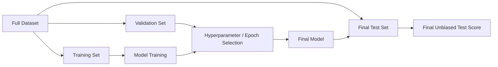

For the purposes of this README, the results below are reported **exactly as recorded in the notebook**, with this limitation explicitly documented.

---

# 4. Preprocessing Pipeline

The notebook performs the following preprocessing:

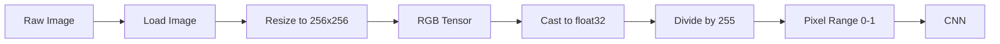

The normalization function used was:

```python
def process(image, label):
    image = tf.cast(image / 255, tf.float32)
    return image, label
```

Then:

```python
train_ds = train_dataset.map(process)
validation_ds = validation_dataset.map(process)
```

### Data augmentation

No augmentation was applied in the recorded experiments.

Examples of augmentation that were **not** used:

- Random horizontal flip
- Random rotation
- Random zoom
- Random contrast
- Random translation

---

# 5. CNN Architecture

The CNN progressively increases the number of convolutional filters:

```text
32 → 64 → 128
```

The spatial dimensions are reduced using MaxPooling.

### Architecture

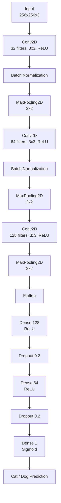

---

# 6. Final Regularized Model

The regularized model shown in the notebook contains:

```python
model = Sequential()

model.add(
    Conv2D(
        32,
        kernel_size=(3,3),
        padding='valid',
        activation='relu',
        input_shape=(256,256,3)
    )
)
model.add(BatchNormalization())
model.add(MaxPooling2D(pool_size=(2,2), strides=2, padding='valid'))

model.add(
    Conv2D(
        64,
        kernel_size=(3,3),
        padding='valid',
        activation='relu',
        input_shape=(256,256,3)
    )
)
model.add(BatchNormalization())
model.add(MaxPooling2D(pool_size=(2,2), strides=2, padding='valid'))

model.add(
    Conv2D(
        128,
        kernel_size=(3,3),
        padding='valid',
        activation='relu'
    )
)
model.add(MaxPooling2D(pool_size=(2,2), strides=2, padding='valid'))

model.add(Flatten())

model.add(Dense(128, activation='relu'))
model.add(Dropout(0.2))

model.add(Dense(64, activation='relu'))
model.add(Dropout(0.2))

model.add(Dense(1, activation='sigmoid'))
```

### Parameter count

The notebook reports:

| Parameter type | Count |
|---|---:|
| Total parameters | **14,847,681** |
| Trainable parameters | **14,847,489** |
| Non-trainable parameters | **192** |

The non-trainable parameters come from Batch Normalization.

---

# 7. Why the Model Is Relatively Large

The largest parameter contribution comes from the first Dense layer after Flattening.

The flattened representation is:

```text
30 × 30 × 128 = 115,200 features
```

The Dense layer contains:

```text
115,200 × 128 + 128
= 14,745,728 parameters
```

Therefore, the Dense layer alone accounts for the vast majority of the model parameters.

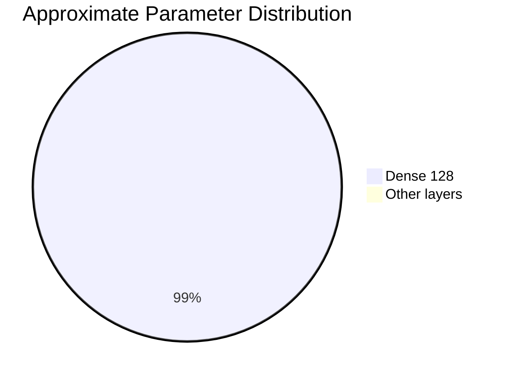

This is also an important reason why the model can overfit.

---

# 8. Model Compilation

The model was compiled using:

```python
model.compile(
    optimizer='adam',
    loss='binary_crossentropy',
    metrics=['accuracy']
)
```

### Training configuration

| Setting | Value |
|---|---|
| Optimizer | Adam |
| Learning rate | `0.001` in the explicitly configured run |
| Loss | Binary Cross-Entropy |
| Metric | Accuracy |
| Batch size | 32 |
| Image size | 256 × 256 |
| Output activation | Sigmoid |
| Task | Binary classification |

---

# 9. Experiment 1 : Baseline CNN

The first CNN did **not** contain the later Batch Normalization and Dropout layers.

Its reported parameter count was:

```text
14,847,297 parameters
```

### Training result

The baseline model showed a clear overfitting pattern.

At the end of the recorded 10-epoch run:

| Metric | Value |
|---|---:|
| Training accuracy | **98.74%** |
| Validation accuracy | **79.64%** |
| Training loss | **0.0417** |
| Validation loss | **1.1015** |

The key pattern was:

```text
Training accuracy  ↑↑
Training loss      ↓↓
Validation accuracy ~stable
Validation loss    ↑↑
```

This is classic evidence that the network was becoming increasingly specialized to the training data.

### Baseline accuracy

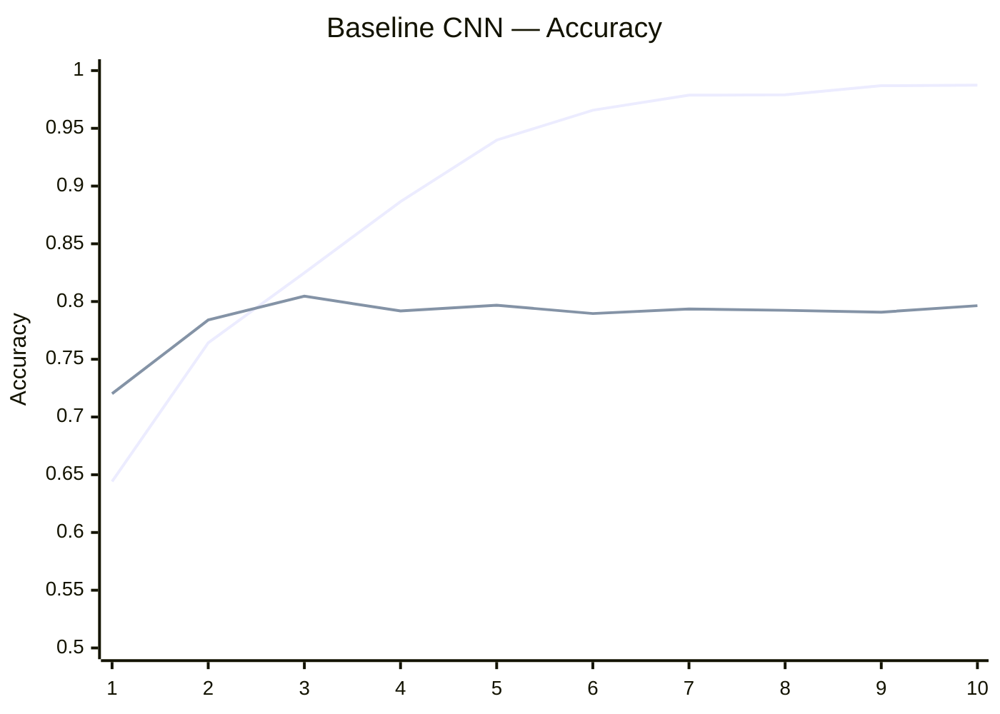

### Baseline loss

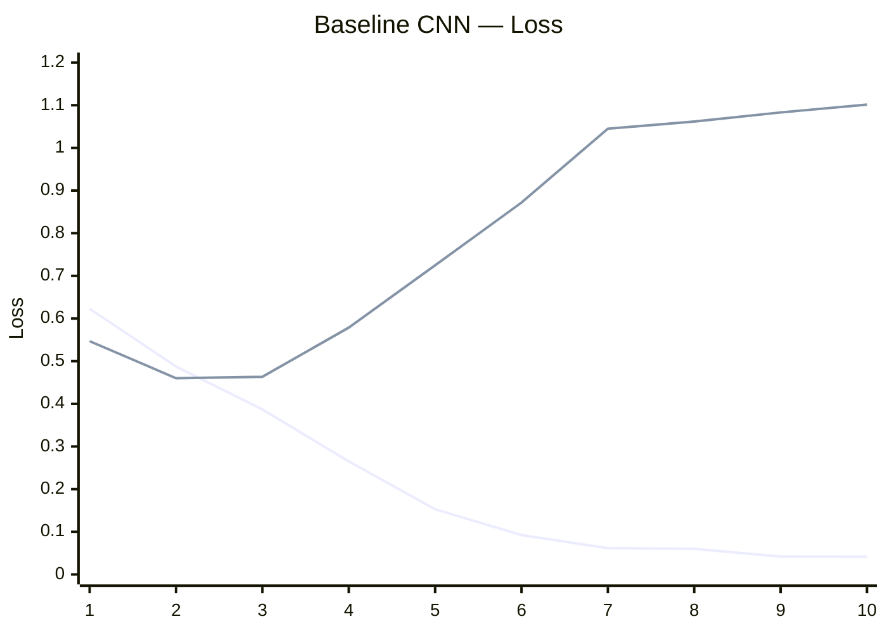

**Interpretation:** the training loss continues falling while validation loss rises strongly after the early epochs.

---

# 10. Experiment 2 : Batch Normalization + Dropout

To address overfitting, the next architecture introduced:

- Batch Normalization after the first two convolutional layers
- Dropout `0.2` after each dense hidden layer

This increased the total parameter count only slightly:

```text
14,847,681 parameters
```

The goal was to improve generalization without changing the overall CNN structure.

---

# 11. Regularized Model : Recorded 10-Epoch Run

One recorded run of the Batch Normalization + Dropout model produced:

| Epoch | Train Accuracy | Validation Accuracy |
|---:|---:|---:|
| 1 | 0.5875 | 0.5900 |
| 2 | 0.6048 | 0.6312 |
| 3 | 0.6399 | 0.7148 |
| 4 | 0.6878 | 0.7314 |
| 5 | 0.7182 | 0.6578 |
| 6 | 0.7333 | 0.7618 |
| 7 | 0.7523 | 0.5770 |
| 8 | 0.7607 | 0.6578 |
| 9 | 0.7818 | 0.7630 |
| 10 | **0.7882** | **0.8284** |

The highest recorded validation accuracy in this run was:

> **82.84%**

The final recorded training accuracy was:

> **78.82%**

### Accuracy curve

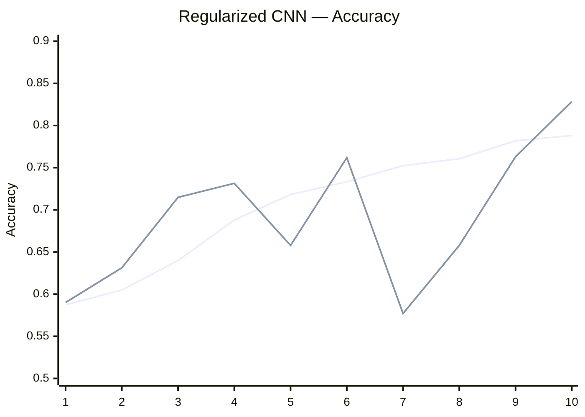

### Loss curve

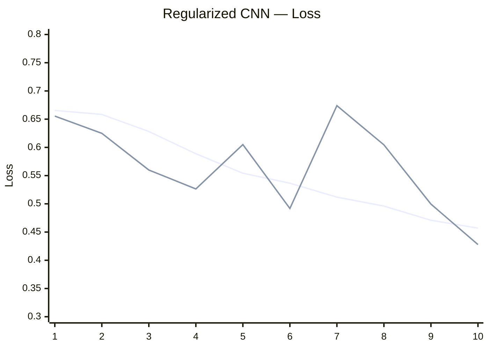

---

# 12. Experiment 3 : Early Stopping

A later training run added an Early Stopping callback configured with:

```python
EarlyStopping(
    patience=3,
    restore_best_weights=True
)
```

### Recorded results

| Epoch | Train Accuracy | Validation Accuracy |
|---:|---:|---:|
| 1 | 0.5974 | 0.5974 |
| 2 | 0.6525 | 0.6770 |
| 3 | 0.7193 | **0.7428** |
| 4 | 0.7728 | 0.6740 |
| 5 | 0.8062 | 0.7576 |
| 6 | 0.8383 | **0.7836** |
| 7 | 0.8723 | 0.7832 |
| 8 | 0.9080 | 0.7664 |
| 9 | 0.9309 | 0.7762 |

The best validation accuracy visible in this run was:

> **78.36% at Epoch 6**

After that point, training accuracy continued increasing while validation accuracy stopped improving consistently.

This is exactly the type of situation where Early Stopping is useful.

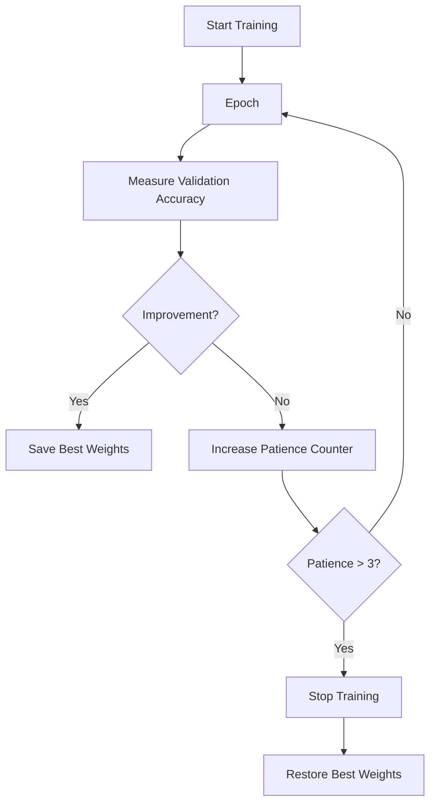

---

# 13. Overfitting Analysis

The baseline experiment demonstrates the clearest overfitting.

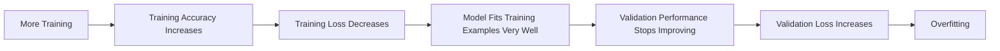

The baseline model eventually reached approximately:

```text
Training accuracy:   98.74%
Validation accuracy: 79.64%
```

The large gap is:

```text
98.74 - 79.64 = 19.10 percentage points
```

That is substantial.

---

# 14. Comparison of Recorded Experiments

| Experiment | Main Change | Best / Final Recorded Validation Accuracy | Training Accuracy at End |
|---|---|---:|---:|
| Baseline CNN | No BN / Dropout | **79.64% final** | **98.74%** |
| Regularized CNN | BN + Dropout | **82.84% recorded best** | **78.82%** |
| Early-Stopping Run | BN + Dropout + EarlyStopping | **78.36% recorded best** | **93.09% at Epoch 9** |

### Main observation

The Batch Normalization + Dropout run produced the **highest recorded validation accuracy: 82.84%**.

However, the results vary substantially between runs. Therefore, the README should not claim that 82.84% is a guaranteed generalization performance.

The cleanest conclusion supported by the recorded experiments is:

> **Regularization reduced the extreme training/validation gap seen in the baseline model, while the best recorded validation accuracy reached 82.84% in one run.**

---

# 15. Training Performance

The Colab runtime reported a T4 GPU:

```text
PhysicalDevice(name='/physical_device:GPU:0', device_type='GPU')
```

A GPU matrix multiplication test also completed successfully.

### Recorded training speed

The training times varied significantly between runs.

One run showed approximately:

```text
~48–54 seconds per epoch
```

while another run showed approximately:

```text
~356–371 seconds per epoch
```

The slower run therefore took roughly:

```text
~1 hour for 10 epochs
```

This difference is much larger than expected from the model architecture alone and suggests that the input/data pipeline or runtime state had a major effect on throughput.

---

# 16. Why the CNN Has So Many Parameters

The main bottleneck is not the convolutional layers.

It is:

```text
Conv → Pool → Conv → Pool → Conv → Pool → Flatten → Dense
```

The `Flatten` layer produces:

```text
30 × 30 × 128 = 115,200 values
```

Connecting those to 128 neurons creates approximately:

```text
14.75 million parameters
```

### Architecture bottleneck

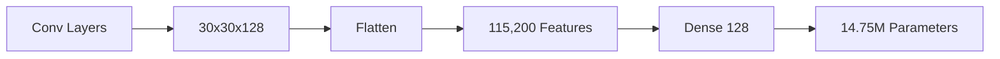

This is the single biggest architectural contributor to model size.

---

# 17. Why the Model Overfits

The model has approximately:

```text
14.85 million trainable parameters
```

but the training set contains:

```text
20,000 images
```

A very large fully-connected layer makes it relatively easy for the network to memorize training-specific patterns.

The observed baseline behavior confirms this:

```text
Train accuracy → ~99%
Validation accuracy → ~80%
Validation loss → keeps increasing
```

The later use of:

- Batch Normalization
- Dropout
- Early Stopping

was therefore motivated by the observed overfitting.

---

# 19. Final Results Summary

### Best recorded validation accuracy

**82.84%**

### Baseline final training accuracy

**98.74%**

### Baseline final validation accuracy

**79.64%**

### Regularized run final training accuracy

**78.82%**

### Regularized run final validation accuracy

**82.84%**

### Early-stopping run best validation accuracy

**78.36%**

### Model size

**14,847,681 parameters**

### Input size

**256 × 256 × 3**

### Number of classes

**2 — Cats and Dogs**

---

# 20. Final Conclusion

The project successfully demonstrates a complete CNN-based binary image-classification workflow.

The initial CNN clearly overfit: training accuracy climbed to approximately **98.7%**, while validation accuracy remained around **80%** and validation loss increased substantially.

Adding **Batch Normalization and Dropout** produced a better recorded validation result, reaching **82.84%** in one run, while keeping the training accuracy much closer to the validation accuracy.

The later Early Stopping experiment also demonstrated the usefulness of monitoring validation performance because training accuracy continued rising after validation performance had largely plateaued.

The most important limitation is the dataset split: the notebook uses the directory named `/content/test` as `validation_data`. Consequently, the reported validation numbers should be treated as **validation-style measurements**, not as a completely untouched final test benchmark.

Overall, the recorded experiments show that:

```text
CNN
  ↓
Baseline model
  ↓
Strong overfitting
  ↓
Batch Normalization + Dropout
  ↓
Improved generalization in one run
  ↓
Early Stopping
  ↓
Better control over continued overfitting
```

---

# 21. Reproducibility

### Environment

```text
Platform: Google Colab
GPU: NVIDIA T4
Framework: TensorFlow / Keras
Python: Python 3 environment
```

### Core libraries

```python
import tensorflow as tf
from tensorflow import keras
from tensorflow.keras import layers
from tensorflow.keras.layers import (
    Dense,
    Flatten,
    Conv2D,
    MaxPooling2D,
    BatchNormalization,
    Dropout
)
from tensorflow.keras.optimizers import Adam
from tensorflow.keras.callbacks import EarlyStopping
import matplotlib.pyplot as plt
```

### Dataset loader

```python
train_dataset = keras.utils.image_dataset_from_directory(
    directory='/content/train',
    labels='inferred',
    label_mode='int',
    batch_size=32,
    image_size=(256,256)
)

validation_dataset = keras.utils.image_dataset_from_directory(
    directory='/content/test',
    labels='inferred',
    label_mode='int',
    batch_size=32,
    image_size=(256,256)
)
```

### Normalization

```python
def process(image, label):
    image = tf.cast(image / 255, tf.float32)
    return image, label

train_ds = train_dataset.map(process)
validation_ds = validation_dataset.map(process)
```

### Compilation

```python
model.compile(
    optimizer=Adam(learning_rate=1e-3),
    loss='binary_crossentropy',
    metrics=['accuracy']
)
```

### Training

```python
history = model.fit(
    train_ds,
    epochs=10,
    validation_data=validation_ds
)
```

### Early Stopping

```python
callback = EarlyStopping(
    monitor='val_loss',
    patience=3,
    restore_best_weights=True
)

history = model.fit(
    train_ds,
    epochs=10,
    validation_data=validation_ds,
    callbacks=[callback]
)
```

---

# 22. Project Architecture at a Glance

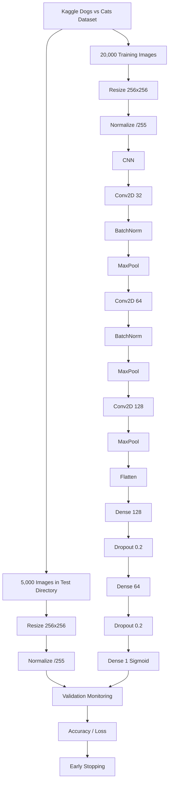

